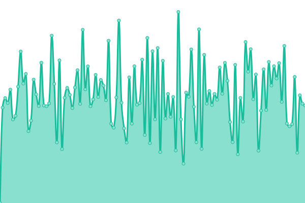
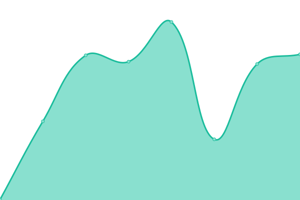
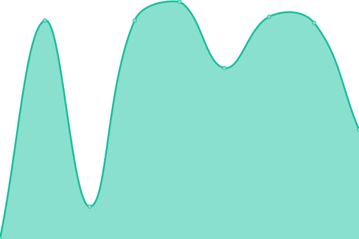

# [📈 Live Status](https://status.ataw.top): <!--live status--> **一切正常 All Operational**

This repository contains the open-source uptime monitor and status page for [艾迪](https://status.ataw.top), powered by [Upptime](https://github.com/upptime/upptime).

With [Upptime](https://upptime.js.org), you can get your own unlimited and free uptime monitor and status page, powered entirely by a GitHub repository. We use [Issues](https://github.com/AnotiaWang/uptime/issues) as incident reports, [Actions](https://github.com/AnotiaWang/uptime/actions) as uptime monitors, and [Pages](https://status.ataw.top) for the status page.

<!--start: status pages-->
<!-- This summary is generated by Upptime (https://github.com/upptime/upptime) -->
<!-- Do not edit this manually, your changes will be overwritten -->
<!-- prettier-ignore -->
| URL | Status | History | Response Time | Uptime |
| --- | ------ | ------- | ------------- | ------ |
|  Server | 在线 | [server.yml](https://github.com/AnotiaWang/uptime/commits/HEAD/history/server.yml) | 

 86ms
     
 | 

<a href="https://status.ataw.top/history/server">100.00%</a>
    

|  [Root Domain](https://www.ataw.top) | 在线 | [root-domain.yml](https://github.com/AnotiaWang/uptime/commits/HEAD/history/root-domain.yml) | 

 490ms
     
 | 

<a href="https://status.ataw.top/history/root-domain">100.00%</a>
    

|  [Blog](https://blog.ataw.top) | 在线 | [blog.yml](https://github.com/AnotiaWang/uptime/commits/HEAD/history/blog.yml) | 

 654ms
     
 | 

<a href="https://status.ataw.top/history/blog">100.00%</a>
    

|  [ATA Drive](https://drive.ataw.top) | 在线 | [ata-drive.yml](https://github.com/AnotiaWang/uptime/commits/HEAD/history/ata-drive.yml) | 

 458ms
     
 | 

<a href="https://status.ataw.top/history/ata-drive">100.00%</a>
    

|  AliYunPanBot | 在线 | [ali-yun-pan-bot.yml](https://github.com/AnotiaWang/uptime/commits/HEAD/history/ali-yun-pan-bot.yml) | 

 413ms
     
 | 

<a href="https://status.ataw.top/history/ali-yun-pan-bot">100.00%</a>
    

|  [Aliyundrive Resources](https://ar.ataw.top) | 在线 | [aliyundrive-resources.yml](https://github.com/AnotiaWang/uptime/commits/HEAD/history/aliyundrive-resources.yml) | 

 692ms
     
 | 

<a href="https://status.ataw.top/history/aliyundrive-resources">100.00%</a>
    

|  [Animenz Sheets](https://animenz.ataw.top) | 在线 | [animenz-sheets.yml](https://github.com/AnotiaWang/uptime/commits/HEAD/history/animenz-sheets.yml) | 

 389ms
     
 | 

<a href="https://status.ataw.top/history/animenz-sheets">100.00%</a>
    

|  Magnet Console | 在线 | [magnet-console.yml](https://github.com/AnotiaWang/uptime/commits/HEAD/history/magnet-console.yml) | 

 489ms
     
 | 

<a href="https://status.ataw.top/history/magnet-console">45.47%</a>
    

<!--end: status pages-->

[**Visit our status website →**](https://status.ataw.top)

## 📄 License

- Powered by: [Upptime](https://github.com/upptime/upptime)
- Code: [MIT](./LICENSE) © [艾迪](https://status.ataw.top)
- Data in the `./history` directory: [Open Database License](https://opendatacommons.org/licenses/odbl/1-0/)
